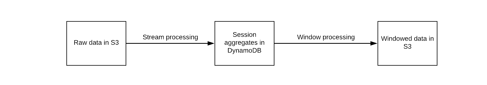

# Blurr

Blurr is a data pipeline authoring environment for real-time predictive models. Work directly with raw data to construct a production ML pipeline in minutes. We believe in a world where everyone is a data engineer. Or a data scientist. Or an ML engineer. The distinction is increasingly blurry (*cough*). Just like development and operations merged over time into DevOps.

When working with data, it is important to iterate fast and the best way to do that is by working directly with the raw data. With Blurr we want to give product teams the ability to iterate quickly when doing ML dev and take things to production using a self-service model.

Blurr provides a high-level expressive YAML-based language called the Data Transform Configuration (DTC). The DTC defines custom data transformations and aggregations from a data source (S3), to transform the data (in lambdas) and output to a data store (DynamoDB). The data in the store can be used for any application dependent on real-time transformations like analytics or predictions.

Blurr has first class support for serverless data processing which means near zero standing costs, great for spiky usage, infinite scale and zero maintenance headache.

# Examples

We're putting together examples for how to use Blurr to build models for specific use cases.

[Dynamic in-game offers (Offer AI)](examples/offer-ai/offer-ai-walkthrough.md)

More to come!

# Status and License

Blurr is currently in closed development. We're targeting a first release in early April, 2018. Email blurr@productml.com to get notified when it is out! Even better, star or watch this GitHub project!

We intend to license Blurr as an open source project. We will update the license + contribution guidelines with the first release.
