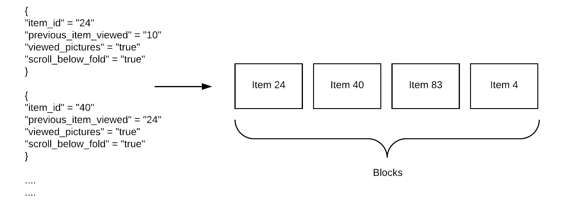
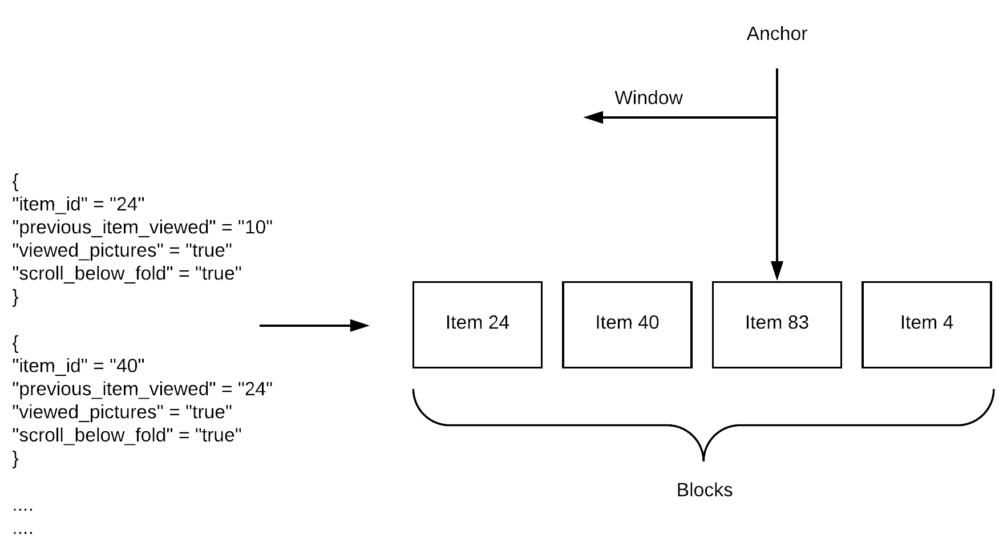
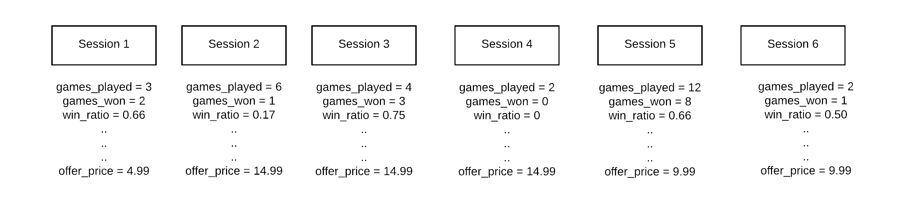
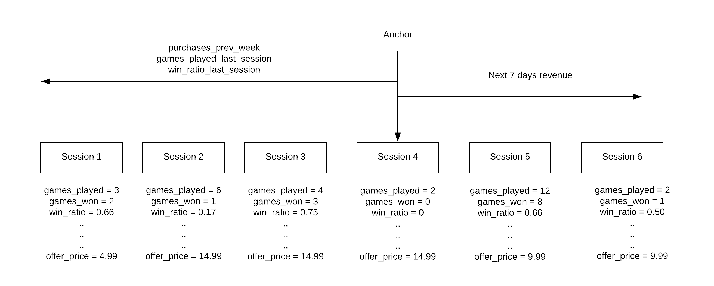

The core of Blurr is the Data Transformation Configuration (DTC).


There are 2 types of DTCs - Streaming and Window DTC.

The Streaming DTC takes raw data and converts it into blocks.



The Window DTC generates data relative to a block. This is especially useful for building features for machine learning models.



# The anatomy of a Streaming DTC

The raw event being processed is defined as `source` in the DTC. Event parameters are accessed as `source.<key>` such as `source.user_id`. DTCs are processed in a python 3.6 environment and the expressions used for field values are executed as python statements.

## Header

```yaml
Type: Blurr:Streaming
Version: '2018-03-07'
Description: Create blocks from streaming Raw Data
Name: offer_ai_v1
Identity: source.user_id
Time: parse_time(source.event_time, 'YYYY/mm/dd HH:MM:SS')
When: source.package_version = '1.0'
```

Key |  Description | Allowed values | Required
--- | ------------ | -------------- | --------
Type | The type of DTC - Streaming or Window | `Blurr:Streaming` or `Blurr:Window` | Required
Version | Version number of the DTC, used by the Data Transformer Library to parse the template | Specific DTC versions only `2018-03-01` | Required
Description | Text description for the DTC | Any `string`  | Optional
Name | Unique name for the DTC | Any `string` | Required
Identity | The dimension in the raw data around which data is aggregated | `source.<field>` | Required
Time | Define what field in the source data to use as the time of the event. This is available as `time` for other expressions to use. If source does not contain time then the `datetime.utcnow()` expression can be used to retrieve the current utc datetime | Any python `datetime` object | Optional
When | Boolean expression that defines which raw data should be processed | Any `boolean` expression | Optional

## Store

At the end of a transform, data is persisted in the store. The Data Transform Library (DTL) works with an abstraction of storage which isolates the actual storage tier from how it works with the DTL.

```YAML
Stores:
   - Type: Blurr:Store:MemoryStore
     Name: hello_world_store
```

Key |  Description | Allowed values | Required
--- | ------------ | -------------- | --------
Type | The destination data store | `Blurr:Store:MemoryStore`. More Stores such as S3 and DynamoDB coming soon | Required
Name | Name of the store, used for internal referencing within the DTC | Any `string` | Required


## DataGroups

DataGroups defines groups of data that are either in a one-to-one relationship with the Identity or a in a many-to-one relationship.

There are 3 types of DataGroups in a Streaming DTC.

### IdentityAggregate

`Blurr:DataGroup:IdentityAggregate`. Fields in the IdentityAggregate DataGroups are in a one-to-one relationship with the identity.  There is a single record that stores these fields and change to these fields overwrite the previous value.  There are no historical records kept for state changes.

```yaml
DataGroups:

  - Type: Blurr:DataGroup:IdentityAggregate
    Name: user
    Store: offer_ai_dynamo
    When: source.event_id in ['app_launched', 'user_updated']

    Fields:

      - Name: user_id
        Type: string
        Value: source.customer_identifier

      - Name: country
        Value: source.country
```

Key |  Description | Allowed values | Required
--- | ------------ | -------------- | --------
Type | Type of DataGroup | `Blurr:DataGroup:IdentityAggregate`, `Blurr:DataGroup:BlockAggregate`, `Blurr:DataGroup:Variable` | Required
Name | Name of the DataGroup | Any `string`, unique within the DTC | Required
Store | Name of the Store in which to create the DataGroup  | Stores defined in the DTC | Required
When | Boolean expression that defines which raw events to process | Any `boolean` expression | Optional

A `DataGroup` contains `fields` for the information being stored. IdentityAggregate DataGroup fields are especially useful for data that is relatively static over time - like a user's country.

 Each field in an IdentityAggregate DataGroup has 3 properties.

 Key |  Description | Allowed values | Required
 --- | ------------ | -------------- | --------
 Name | Name of the field | Any `string` | Required
 Type | Type of data being stored | `integer`, `boolean`, `string`, `datetime`, `float`, `map`, `list`, `set` | Optional. If Type is not set, the DTL uses `string` as the default type
 Value | Value of the field | Any python expression, and must match the Type | Required  

 All fields in the DataGroup are encapsulated in a DataGroup object. The object is available in the DTL, which is the python environment processing the DTC. Field values can be accessed using `DataGroupName.FieldName`


### BlockAggregate

`Blurr:DataGroup:BlockAggregate`. Fields in the BlockAggregate DataGroups are in a one-to-many relationship with the identity.  These fields are aggregated together in blocks based on the split condition specified.

```YAML

- Type: Blurr:DataGroup:BlockAggregate
  Name: session
  When: source.app_version > '3.7'
  Split: source.session_id != session.id

  Fields:
    - Name: presents_wrapped
      Type: integer
      Value: session.presents_wrapped + 1
      Filter: source.event_name == 'wrap_present'

```

Key |  Description | Allowed values | Required
--- | ------------ | -------------- | --------
Type | Type of DataGroup | `Blurr:DataGroup:IdentityAggregate`, `Blurr:DataGroup:BlockAggregate`, `Blurr:DataGroup:Variable` | Required
Name | Name of the DataGroup | Any, unique within the DTC | Required
When | Boolean expression that defines which raw events to process | Any `boolean` expression | Optional
Split | Boolean expression that defines when a new block should be created | Any `boolean` expression | Required

All fields in the DataGroup are encapsulated in a DataGroup object. The object is available in the DTL, which is a python environment processing the DTC. Field values can be accessed using `DataGroupName.FieldName`

Each field in an BlockAggregate DataGroup has 4 properties.

Key |  Description | Allowed values | Required
--- | ------------ | -------------- | --------
Name | Name of the field | Any `string` | Required
Type | Type of data being stored | `integer`, `boolean`, `string`, `datetime`, `float`, `map`, `list`, `set` | Optional. If Type is not set, the DTL uses `string` as the default type
Value | Value of the field | Any python expression, and must match the Type | Required  
When | Boolean expression that defines which raw events to process | Any `boolean` expression | Optional

### Variable

`Blurr:DataGroup:Variable`. Variable DataGroups are temporary variables that can be used in other data blocks. Variables aim to reduce code duplication and improve readability. They are useful for cleansing / modifying / typecasting source elements and representing complex filter conditions that evaluate to a binary value.

```yaml
- Type: Blurr:DataGroup:Variable
  Name: vars
  Fields:
    - Name: item_price_micro
      Type: integer
      Value: int(float(source.item_price) * 1000000)

```

This can be accessed as `vars.item_price_micro` anywhere in the Streaming DTC

# Window DTC

Windowing concepts in Blurr are similar to the concepts in [Apache Spark/Flink](https://softwaremill.com/windowing-in-big-data-streams-spark-flink-kafka-akka/).

Once the Streaming DTC has run, the raw data is split into blocks. The Window DTC generates data relative to a block.



Say we're training a model to predict what sales offer to show to a user in a session. We want the features of this model to be `purchases_prev_week`, `games_played_last_session` and `win_ratio_last_session`. We'd like to predict `next_7_days_revenue`.

When training a model, the data needs to be organized around the decision point.  We want to know the value of the features at the point an offer is shown. So if the offer is shown during session 4, the features need to be relative to session 4. And the optimization function (total revenue over next 7 days) needs to be relative to session 4 as well.



The decision point is the Anchor. A window defines segments of data relative to the anchor. In this case, we need the features and optimization function relative to when an offer is shown.

# The anatomy of a Window DTC

## Header

```yaml
Type: Blurr:Window
Version: '2018-03-01'
Description: Generate features around an Anchor
Name: Window Example
SourceDTC: offer_ai_v1
```

Key |  Description | Allowed values | Required
--- | ------------ | -------------- | --------
Type | The type of DTC - Streaming or Window | `Blurr:Streaming` or `Blurr:Window` | Required
Version | Version number of the DTC, used by the Data Transformer Library to parse the template | Specific DTC versions only `2018-03-01` | Required
Description | Text description for the DTC | Any `string` | Optional
Name | Unique name for the Window DTC | Any `string` | Required
SourceDTC | The name of the streaming DTC upon which this window DTC will be executed | Valid streaming DTC | Required

## Anchor

An Anchor represents a decision made at a point in time. For example: when a model to pick the offer price for a user is being used, then this decision being made is an Anchor.

This is a vital concept to align the way data processing is done for training data generation and for prediction. The training data is generated as if the only information that was available was up to the Anchor point. Anything after the Anchor point can only be used as a label (which is what the model will predict).

```yaml
Anchor:
  Condition:  offer_ai_v1.game_stats.offer_type != ''
  Max: 1
```

Condition is a python expression which returns a `boolean` value to determine if an anchor condition exists in the block being processed. Field values in a block are accessed as `StreamingDTCName.DataGroupName.FieldName`.

Max defines the maximum number of output rows to be generated every time the Window DTC is run.

When the number of blocks that satisfy the anchor condition is more than the max value specified, then, a ‘max’ number of satisfying sessions are picked randomly. Max can be used to prevent oversampling of more active users.

## Store


```YAML
Stores:
   - Type: Blurr:Store:MemoryStore
     Name: hello_world_store
```

Key |  Description | Allowed values | Required
--- | ------------ | -------------- | --------
Type | The destination data store | `Blurr:Store:MemoryStore`. More Stores such as S3 and DynamoDB coming soon | Required
Name | Name of the store, used for internal referencing within the DTC | Any `string` | Required


## DataGroups

All DataGroup operations that are performed in a window DTC can only use the following available data:

1. Anchor block - Block that satisfies the anchor condition. The fields from the anchor block can be accessed as `anchor.FieldName`.
2. IdentityAggregate - Identity aggregates available from the source Streaming DTC. The fields from an IdentityAggregate can be accessed as `StreamingDTCName.IdentityAggregateName.Field Name`.
3. A window of blocks around the anchor block - A list of blocks from a BlockAggregate DataGroup before or after the anchor block based on the window defined. A field from the list of blocks is referenced as `WindowName.FieldName`.

### WindowAggregate

```yaml

DataGroups:

  DataGroups:
   - Type: Blurr:DataGroup:WindowAggregate
     Name: last_session
        # Defines a processing window for the rollup. Supported window types are Day, Hour and Count
     WindowType: count
        # Negative values are backward from the Anchor
     WindowValue: -1
     Source: offer_ai_v1.game_stats

     Fields:

         # The output will contain a column for last_session.games_played
      - Name: games_played
        Type: integer
         # source.games_played is a list containing the games_played information from the
         # sessions that fall in the window defined above. In this case, because of a count
         # window of 1 the source.games_played list only contains a single data point.
        Value: source.games_played[0]
```

Key |  Description | Allowed values | Required
--- | ------------ | -------------- | --------
Type | Type of DataGroup | `Blurr:DataGroup:WindowAggregate`, `Blurr:DataGroup:Variable` | Required
Name | Name of the DataGroup | Any `string`, unique within the DTC | Required
WindowType | The type of window to use around the anchor block | `day`, `hour`, `count` | Optional. A WindowAggregate can be defined without a Window
WindowValue | The number of days, hours or blocks to window around the anchor block | Integer | Optional. A WindowAggregate can be defined without a Window
Source | The BlockAggregate DataGroup (defined in the Streaming DTC) on which the window operations should be performed | Valid BlockAggregate DataGroup | Required

All functions defined on windows work on a list of values. For e.g. if a session contains a `games_played` field and a `last_week` window is defined on it, then `last_week.games_played` represents the list of values from last week's sessions.

Each field in a WindowAggregate DataGroup has 3 properties.

Key |  Description | Allowed values | Required
--- | ------------ | -------------- | --------
Name | Name of the field | Any `string` | Required
Type | Type of data being stored | `integer`, `boolean`, `string`, `datetime`, `float`, `map`, `list`, `set` | Optional. If Type is not set, the DTL uses `string` as the default type
Value | Value of the field | Any python expression, and must match the Type | Required

### Variable

The Variable DataGroup works exactly the same as in the Streaming DTC.

## Order of DataGroups

DataGroups can be defined in any order. However, if field values are referenced within the DTC, they must be defined in the order in which they are referenced. For example, if a `BlockAggregate` uses a `Variable`, then the `Variable` DataGroup should be defined before the `BlockAggregate` so that the `Variable` is processed first and available to the `BlockAggregate` when the `BlockAggregate` is being processed.

# Processing field values

All field values must be valid python expressions. These expressions are executed by the Data Transform Library (DTL), which uses a Python 3.6 interpreter.

## Errors

Field values are not recorded when:

1. Evaluation results in an error
2. A None value is returned / no values are returned
3. Value returned is of a type different from the type of the field and casting the value to the required type fails.

## Types

If a type is not specified for a field, it is assumed that it is a `string`. The following types are supported.

Type |  Description | Expected format | Default
--- | ------------ | -------------- | --------
`integer` | integers! | 2 | 0
`boolean` | boolean! | true | false
`string` | default type | 'this is a string' | ''
`datetime` | datetime | any datetime object in python | -
`float` | floating point numbers with decimals | 1.2 | 0.0
`map` | Any type to type maps | ‘{“a”: 1, “b”: 2}’ | empty map
`list` | lists can contain any type of data | ‘[1,2,3]’ | empty list
`set` | contains only unique elements that are `integer`, `long`, `float` and `strings` | - | empty set

# Reserved keywords

## Reserved Field Names
```
identity
time
start_time
end_time
name
schema
type
window
split
filter
```
## Reserved Function Names
```
add_to_map
add_to_set
counter
```
