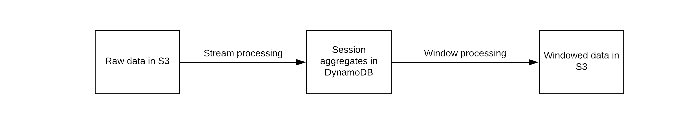

```
We believe in a world where everyone is a data engineer. Or a data scientist. Or an ML engineer.
The distinction is increasingly blurry (*cough*).
Like development and operations merged into DevOps over time.
```

Work directly with raw data to construct a production ML pipeline, in minutes - without writing code.

Blurr enables data scientists and engineers to build and deploy real-time predictive models by:

1. Providing a data pipeline that transforms `raw data` into `features` for model training and prediction
2. Defining a high level authoring language that executes data transforms without writing code

For production ML applications, `experimentation and iteration speed` is important. Working directly with raw data provides the most flexibility. Blurr allows product teams to iterate quickly during ML dev and provides a self-service way to take experiments to production.


Blurr provides a `high-level expressive YAML-based language` called the Data Transform Configuration (DTC). The DTC defines custom data transformations and aggregations from a `data source` (S3), to `transform the data` (in lambdas) and output to a `data store` (S3). The data in the store can be used for any application dependent on real-time transformations like analytics or predictions.



Blurr has first class support for serverless data processing which means near zero standing costs, great for spiky usage, infinite scale and zero maintenance headache.
