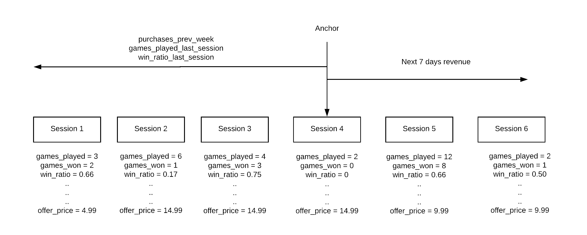

Blurr takes raw data and converts it into model features by applying the data transformation configurations (DTCs).

## Example

We have a game. A `game_result` event is triggered when a user finishes playing a level.

```javascript
{
  user_id:  "<guid>",
  event_name: "game_result",
  event_type: "session_info",
  event_params_game_level: "game_level",
  event_params_game_result: "1",
  event_timestamp: "<iso_8601_date>"
  country: "<country code>"
}
```

From this raw data, we will compute:

1. Average games played per session in the last 7 days
2. Average win rate in the last 14 days
3. Games played in the next session

The raw data is grouped into block aggregates - sessions, in this case:


Model features are then calculated relative to every session.



These transforms are defined in the DTC.

Next: [DTCs](dtc.md)
