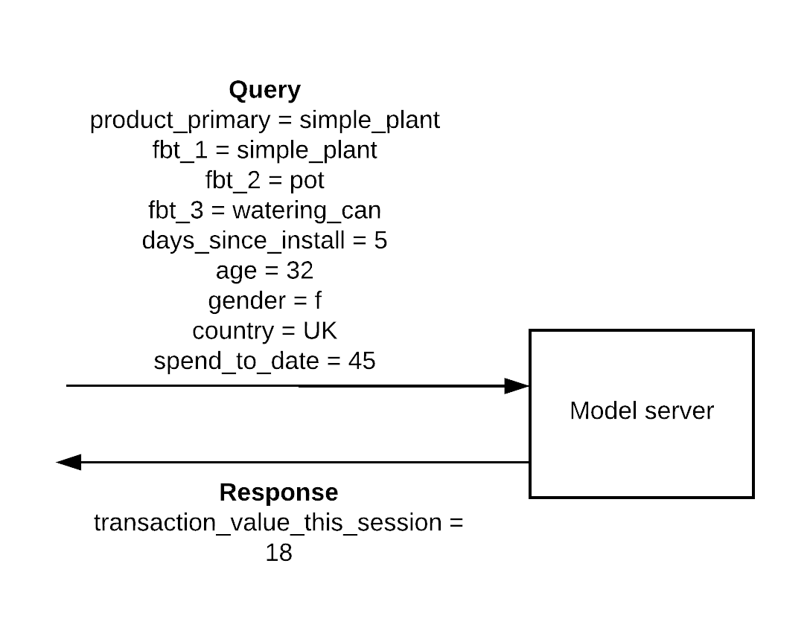

# Frequently bought together

In this example, we’ll walk through building a ‘Frequently bought together’ feature to show in a mobile e-commerce app using Firebase events.


When a user views a ‘Simple Plant’ in our e-commerce app, we want to promote a set of products to encourage the user to spend more and hence increase the transaction value.

Therefore, the model that we’d like to build is:

Given a `product listing`, a set of `frequently bought together products` and a `specific user`, predict the `transaction value`.

Let’s say that we’re looking for the following features to train our initial model:

1. The product listing (`product_primary`)
2. Frequently bought together products (`fbt_1`, `fbt_2`, `fbt_3`)
3. Sessions in the past week (`session_index`)
4. Days since install (`days_since_install`)
5. User’s age (`age`)
6. User’s gender (`gender`)
7. User’s country (`country`)
8. User’s spend so far (`spend_to_date`)

and we will predict

9. User's spend in the current session (`transaction_value_this_session`)

Once we’ve trained and deployed the model, we query it with the model features and it returns a prediction for the transaction value in this session.


Doing it this way allows us to query the model multiple times with different `fbt_*` products, and use the ones that result in the highest `transaction_value_this_session`.  




The model predicts a higher `transaction_value_this_session` for `simple_plant`, `complex_plant` and `plant_food`, so we’ll show that to the user instead of `simple_plant`, `pot` and `watering_can`.

# Getting Firebase or Swrve data into S3

TODO: write this section/link to another article
(Cloud Functions for Firebase + https://support.klipfolio.com/hc/en-us/articles/216181627-Use-Swrve-as-a-data-source for Swrve)


## Default Firebase events

If we’re using the Firebase SDK, some events and user properties are collected by default. A full list of events and user properties can be found in the [official Firebase documentation](https://support.google.com/firebase/answer/6317485?hl=en&ref_topic=6317484).

We’re assuming that we are using the Firebase SDK, and have implemented the [recommended events for retail/e-commerce](https://support.google.com/firebase/answer/6317499?hl=en&ref_topic=6317484). We’ll work with these + [automatically collected user properties](https://support.google.com/firebase/answer/6317486?hl=en&ref_topic=6317484).

Example events are below.

Session start event

```
[
{
'event_name': 'session_start’
'session_id': '72a039b9-6759-901a-cf3a-3354d21beed2’
'start_time': '2018-01-14T17:53:57'
'appInstanceId': '72a039b9-6759-901a-cf3a-3354d21beed2',
'age': '25-34',
'app_Store': 'iTunes',
'app_Version': '3.4.2',
'country': 'BR',
'device_brand': 'Apple',
'device_category': 'tablet',
'device_model': 'iPad Pro',
'first_open_time': '2017-12-02T23:00:00',
'gender': 'male',
'interests': 'arts & entertainment, games',
'language': 'pt-br',
'new/established': 'established',
'os_version': '10.1'
}
]
```

Product page is viewed

```
[
{
'event_name': 'view_item’
'appInstanceId': '72a039b9-6759-901a-cf3a-3354d21beed2',
'session_id': '72a039b9-6759-901a-cf3a-3354d21beed2’
'item_id': '32',
'item_name': 'simple_plant',
'item_category': 'plants'
}
]
```

Frequently Bought Together can be tracked in many ways and implementations in the wild will almost certainly involve custom event params. For this example, we assume that:

1. The event is implemented as an list of `item_ids` in the `view_item` event, with the `item_category` being the primary product being viewed - in this case, `simple_plant`.
2. When a product listing page is shown with the ‘Frequently Bought Together’ feature, 2 separate `view_item` events are triggered - one for the primary product, and one for the frequently bought together

```
[
{
'event_name': 'view_item’
'appInstanceId': '72a039b9-6759-901a-cf3a-3354d21beed2',
'session_id': '72a039b9-6759-901a-cf3a-3354d21beed2’
'item_id': '32, 42, 94',
'item_name': 'simple_plant, pot, watering_can',
'item_category': 'itemid=32'
}
]
```

Purchase

```
[
{
'event_name': 'ecommerce_purchase’
'appInstanceId': '72a039b9-6759-901a-cf3a-3354d21beed2',
'session_id': '72a039b9-6759-901a-cf3a-3354d21beed2’
'item_id': '32, 42, 94',
'currency': 'usd',
'value': '12'
}
]
```

# Transforming data

To train the model, we are looking for data to be organized like this.

Unique user_id (appInstanceId) | product_primary | fbt_1 | fbt_2 | fbt_3 | session_index | days_since_install | age | gender | country | spend_to_date | transaction_value_this_session
------- | ------- | ------------------ | ------------------------- | ------------------------- | ---------------------- | ----- | ----- | ----- | ----- | ----- | -------

[Streaming DTC](fbt-streaming-dtc.yml)

[Window DTC](fbt-window-dtc.yml)
