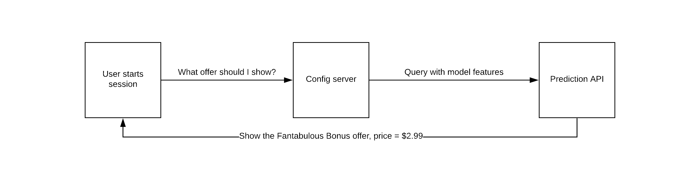
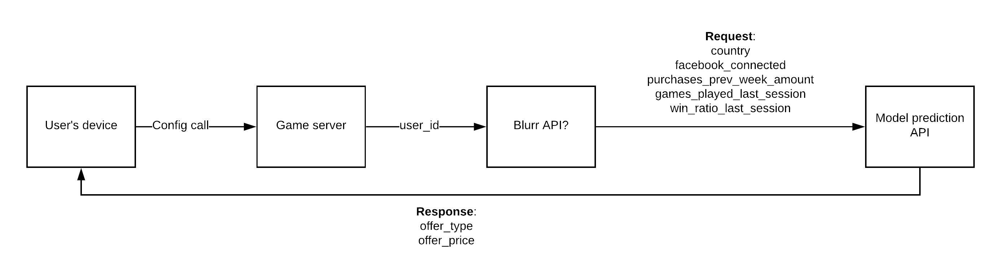

# Offer AI example

## What is Blurr?

Blurr is a data pipeline authoring environment for real-time predictive models. Work directly with raw data to construct a production ML pipeline in minutes. We believe in a world where everyone is a data engineer. Or a data scientist. Or an ML engineer. The distinction is blurred (cough). Just like development and operations merged over time into DevOps.

When working with data, it is important to iterate fast and the best way to do that is by working directly with the raw data. Doing a full end to end data engineering + ML dev + production ready model can take a few months.

With Blurr we want to give product teams the ability to iterate quickly when doing ML dev and take things to production using a self-service model.

Blurr takes out the complexity in data transformation by providing a high-level expressive YAML based schema language called Data Transform Schema (DTS). The DTS defines custom data transformations and aggregations from a data source (S3), to transform the data (in lambdas) and output to a data store (DynamoDB). The data in the store can be used for any application dependent on real-time transformations like analytics or predictions.

Blurr has first class support for serverless data processing, which means near zero standard cost and infinite scale - which will reduce cost of operations for fluctuating workloads.  Isolating the transformation template from the underlying technology also allows for transparent portability of ETL processes from premise to cloud, or across clouds, and to the device endpoint where real-time rollup may happen.

## Offer AI objective

Imagine that we have a game. We want to be able to show personalized offers to the user via an in-app purchase.



To do that, we need the features that were used in training the model readily available to query when the users shows up. If we used `games_played_last_session` as one of the features, when the user starts a new session, we need the `games_played_last_session` data to query the model to get the prediction. Ideally, ASAP.

In this example, we'll work directly with raw data from events in the game to prepare the features needed to run such a model in production.  

This is a model that continuously learns based on the feedback received as the user interacts with the product and makes a purchase (or not).

To train the model, we need a dataset where we can observe how users behave when presented with different offers and prices. We’re assuming that we don’t have that, and we're not training on historical data. We want a contextual bandit approach to continuously personalize the ‘winning treatment’ for each user. More on contextual bandits. [here](http://pavel.surmenok.com/2017/08/26/contextual-bandits-and-reinforcement-learning/)

TODO: Broader article comparing A/B tests vs. contextual bandit

For the purposes of this example, let's say we want these features:

* country
* facebook_connected
* purchases_prev_week_amount
* games_played_last_session
* win_ratio_last_session

The model then predicts

* offer_type
* offer_price

# Raw Data

Blurr assumes that there is raw data from the game that is landing
in an S3 bucket. Depending on our internal setup, this could be as simple as point your current raw data ingestion end-point (such as Firehose) to the S3 bucket.

We also assume that the raw data arrives in a JSON format.

Here’s an example JSON file with raw data from a game. Even though we are using a game example, we’ve built Blurr to be used in any product context - not just games.

## Peeking at raw data

We assume that when a users plays a game, the following events are sent as raw data.

```
[
{
'country': 'DE',
'language': 'DE',
'signin_method': 'https://www.instagram.com/DepictNone.2002',
'package_name': 'my_app',
'package_version': '1.0',
'os': 'Android',
'os_version': '6.4.5',
'device_type': 'phone',
'device_make': 'Acer',
'device_model': 'BlackBerry 10 Z30',
'device_id': '73f94c25-1d7a-f484-e194-0952b9a891f8',
'event_id': 'app_launched',
'event_time': '2017-08-14T17:53:57',
'customer_identifier': '72a039b9-6759-901a-cf3a-3354d21beed2',
'session_id': 'ey3je39-932u73'
},

{
'event_id': 'game_start',
'event_time': '2017-08-14T17:54:12',
'customer_identifier': '72a039b9-6759-901a-cf3a-3354d21beed2',
'session_id': 'ey3je39-932u73',
'currency_balance': '3400',
'level': '7'
},

{
'event_id': 'game_end',
'event_time': '2017-08-14T17:54:08',
'customer_identifier': '72a039b9-6759-901a-cf3a-3354d21beed2',
'session_id': 'ey3je39-932u73',
'currency_balance': '4000',
'level': '7',
'score': '8987',
'badge': '3',
'won': '1'
}
]

```

When an offer is shown, the following events are triggered.

```

[
{
'event_id': 'offer_shown',
'event_time': '2017-08-14T17:54:08',
'customer_identifier': '72a039b9-6759-901a-cf3a-3354d21beed2',
'session_id': 'ey3je39-932u73',
'currency_balance': '4000',
'offer_type': 'xmas'
'offer_price': '9.99'
'offer_purchased': 'false'
'offer_dismissed': 'true'
}

{
'event_id': 'purchase',
'event_time': '2017-08-14T17:54:08',
'customer_identifier': '72a039b9-6759-901a-cf3a-3354d21beed2',
'session_id': 'ey3je39-932u73',
'currency_balance': '4000',
'sku': 'coins-pack-4'
'txn_amount': '4.99'
'purchase_source': 'shop'
}
]

```

We want the end result to look like this - these are the features in the model.

user_id | country | facebook_connected | purchases_prev_week_amount | games_played_last_session | win_ratio_last_session

# Writing data transforms

Data is prepared in a two step process.


First, we process raw data and aggregate into sessions. Processing instructions are defined in a Data Transform Configuration (DTC). Event Data + DTC creates DataGroups, which can be used as session aggregates.


Separate data transform configs (DTCs) are used for each step - Streaming DTC for stream processing (Step 1) and Window DTC for rollups (Step 2).

## Streaming DTC

```
####
#Header block that defines the properties of this DTC
####

#Type of DTC. Streaming or Window
#The Streaming DTC processes the raw data and converts it into sessions
Type: ProductML:DTC:Streaming
Version: '2018-03-07'
Description: Level 1 transformation from streaming Raw Data
Name: offer_ai_v1

#The field in the raw data around which data is aggregated. This is usually a unique user id
Identity: source.user_id
Time: parse_time(source.event_time, 'YYYY/mm/dd HH:MM:SS')

#A boolean expression that filters out raw data to be processed
Filter: source.package_version = '1.0'

##
#The raw data is converted to sessions and stored in persistent storage such as DynamoDB (a Store)
#Store properties. Only DynamoDB is supported currently
##

Store:
   - Type: ProductML:DTC:Storage:DynamoDB
     Name: offer_ai_dynamo
#Days to retain data
     Retention: 180
     Table: ProductML_Test_Win_Ratios

DataGroups:

##
#IdentityAggregate is meant for user profile information that is rarely updated. This is processed first
#These are things like country, install source and whether user is logged in to Facebook
##

 - Type: ProductML:DTC:DataGroup:IdentityAggregate
   Name: user
   Store: dynamo
   Filter: source.event_id in ['app_launched', 'user_updated']

   Fields:
     - Name: user_id
       Value: source.customer_identifier

   Fields:
     - Name: country
       Value: source.country

    Fields:
     - Name: fb_connected
       Value: source.fb


##
#Session aggregates definition
##

 - Type: ProductML:DTC:DataGroup:SessionAggregate
   Name: game_stats
#We defined this store earlier
   Store: dynamo
#Split defines when a new session is created when the boolean expression is TRUE
   Split: source.session_id != session_id

   Fields:
     - Name: games_played
#String is the default type and is used if type is not defined
       Type: integer
       Value: games_played + 1
       Filter: source.event_id == 'game_start'

##
#Any valid Python expression can be used for Value and Filter fields
#The underlying interpreter for DTCs is Python v3.6
##

     - Name: games_won
       Type: integer
       Value: games_won + 1
       Filter: source.event_id == 'game_end' and source.won == '1'

     - Name: win_ratio
       Type: float
       Value: game_stats.games_played/game_stats.games_won
       Filter: source.event_id == 'game_end'

     - Name: purchase_amount
       Type: float
       Value:  purchase_amount + source.txn_amount
       Filter: source.event_id == 'purchase'

     - Name: offer_type
       Value:  source.offer_type
       Filter: source.event_id == 'offer_shown'

     - Name: offer_purchased
       Value:  source.offer_purchased
       Tyoe: boolean
       Filter: source.event_id == 'offer_shown'

     - Name: offer_price
       Type: float
       Value:  source.offer_price
       Filter: source.event_id == 'offer_shown'

```

When the Streaming DTC is run, the data is added in DynamoDB.

TODO: Add screenshot of DynamoDB

Each ‘row’ is a session, because we defined the split in the DTC as `source.session_id != session_id`. If we had used `source.event_date != event_date`, the raw data would be aggregated by day. Any `boolean` expression can be used to define a split.

The second step is to prepare rollups on top of the session aggregates and is especially useful for making time window-based aggregations to prepare training and prediction query data for a machine learning model.

TODO: Add bridge to explain windowing concepts

## Window DTC

```

####
#Header block that defines the properties of this DTC
####

#Type of DTC. Streaming or Window
#The Window DTC applies windows operations on top of sessionized data
Type: ProductML:DTC:Window
Version: '2018-03-01'
Description: Second Level processing for feature generation

Name: ProductMLExample

#The DTC used in Step 1
SourceDTC: offer_ai_v1

#Anchor defines the condition used to trigger the decision
#If an offer is shown to the user in this session, the session
#in which the offer is shown is the anchor

Anchor:

###
 Condition:  any(offer_type) in offer_ai_v1.game_stats.offer_type
 Max: 1

##
#Window aggregations are stored in S3 (a Store)
#Defines the Store properties
##

Store:
   - Type: ProductML:DTC:Storage:S3
     Name: s3
     Bucket: offer-ai-example
     Prefix: /dtc-test/window/


DataGroups:

 - Type: ProductML:DTC:DataGroup:AnchorAggregate
 Window:
     #Defines a processing window for the rollup. Supported window types are Day, Hour and Count
     Type: count
     #Negative values are backward from the Anchor
     Value: -1
     Source: offer_ai_v1.game_stats
     Name: prev_session

   Fields:
     - Name: games_played_last_session
       Type: integer
       Value: prev_session.games_played

     - Name: win_ratio_last_session
       Type: float
       Value: prev_session.win_ratio

 - Type: ProductML:DTC:DataGroup:AnchorAggregate
 Name: prev_week
   Window:
     - Type: day
       Values: -7
       Source: offer_ai_v1.game_stats
       Name: prev_week

   Fields:
     - Name: purchases_prev_week_amount
       Type: float
       Value: prev_week.purchase_amount

```

After a Window DTC is run, we have data in S3 that looks like this.

user_id | purchases_prev_week_amount | games_played_last_session | win_ratio_last_session
------- | -------------------------- | ------------------------- | ----------------------

902844 | 1.99 | 6 | 0.50
768264 | 0 | 10 | 0.75
482640| 9.99 | 5 | 0.60

Combined with the sessionized data generated by the Streaming DTC, we now have our features ready.

# Training a model

Once the data is in S3 and DynamoDB, we can set up any training pipeline we want, as long as we can read the data from S3 and DynamoDB.

AWS Sagemaker is an option here to train the model and host it for predictions. We’ve also put together a guide to building your own AMI to run Tensorflow.

TODO: Add link to article

Sagemaker starts off with creating a hosted Jupyter notebook instance which is used for working with data and training models.

The [official Sagemaker documentation](https://docs.aws.amazon.com/sagemaker/latest/dg/how-it-works-training.html) has several great examples. We’ve included a notebook that describes how to build a model to predict video game sales from reviews (TODO: Add link). With Sagemaker, we can train with the data we’ve processed in S3 and deploy a model to be used as a prediction API.

# Use in production

Once this is in production, the end-to-end flow looks like this.


